# Capstone Project - Azure Machine Learning

**Project Overview** - In this project we create two models: one using Automated ML and one customized model whose parameters are tuned using HyperDrive. We then compare the performance of both the models and deploy the best performing model. Once the model is deployed successfully we test the endpoint. This project is a part of the Machine Learning Engineer with Microsoft Azure ND-Udacity.

## Table of Content
* [Project Set Up and Installation](#project-set-up-and-installation)

* [Dataset](#dataset)
  * [Overview](#overview)
  * [Task](#task)
  * [Access](#access)
  
* [Automated ML](#automated-ml)
  * [Results](#result-auto)
  
* [Hyperparameter Tuning](#hyperparameter-tuning)
  * [Results](#result-hyper)
  
* [Model Deployment](#model-deployment)

* [Screen Recording](#screen-recording)

## Project Set Up and Installation
The project doesnot require any additional steps for setup. I have used the Udacity workspace to complete the project and imported the starter files from the Github [repo](https://github.com/udacity/nd00333-capstone/tree/master/starter_file "repo") address provided.

## Dataset

### Overview
The dataset used is Campus Recruitment Data where we have placement information about students in XYZ campus. It has 215 rows and 15 cloumns.
I got this dataset from Kaggle and it was uploaded by Ben Roshan D. The kaggle link is provided [here](https://www.kaggle.com/benroshan/factors-affecting-campus-placement). 

### Task
We will be using this dataset to determine whether a candidate/student will get placed or not. We have split the data and used 80% to train or models and 20% have been reserved as test data which are later used as sample request send to the endpoint once we deployed our best model.
The features used to determine and predict whether or not a candidate will be placed are:
1. Gender - Male or Female
2. ssc_p - Percentage of marks obtained by student in SSC(10th board)
3. hsc_p - Percentage of marks obtained by student in HSC(12th board)
4. degree_p - Percentage of marks obtained by student in the degree course
5. degree_t - Specialization during degree course
6. workex - Whether the student has work experience or not
7. etest_p - Employability test percentage (Conducted by College)
8. specialisation - MBA specialization, options being Mkt & Fin and Mkt & HR
9. mba_p - Percentage of marks obtained in MBA
I have dropped the columns sl_no (serial number), ssc_b (board of SSC), hsc_b(board of HSC) and salary (offered to student after placement) as these columns were not so relevant in determining placement.

The label "status" tells us whether a student was placed or not and this is the target column for predictions.

### Access
The dataset is available in the github repo and it can be downloaded from there or accessed using the web url : 'https://raw.githubusercontent.com/webpagearshi/capstone-project/master/starter_file/placement_data_mba.csv'

If you have downloaded the dataset then you can upload it in the Azure ML workspace and register it to use it.
I have used the web url provided above to create and register the dataset using Python SDK. Once the dataset is registered it can be accessed using the dataset name as key.

## Automated ML
In this model we have used Automated ML to train and tune a model to perform a classification task. The main goal of the classification models is to predict which categories new data will fall into based on learnings from its training data, which in this case is to determine the "status" of the placement of the student.
The automl settings used are:
* experiment_timeout_hours- which is set to 0.3 ,i.e, 18 minutes. experiment_timeout_hours is the maximum time in hours that all iterations combined can take before the experiment terminates. 
* enable_early_stopping- is set to true. This enables early termination if the score is not improving in the short term. We must keep in mind that there is no early stopping for the first 20 iterations and though the early stopping window starts in the 21st iteration it looks for early_stopping_n_iters iterations which is currently set to 10 before the first iteration is stopped, i.e, the 31st iteration. AutoML still schedules 2 ensemble iterations AFTER early stopping, which might result in higher scores. 
* iteration_timeout_minutes- is set to 5 minutes which is the maximum time in minutes that each iteration can run for before it terminates.
* max_concurrent_iterations- is set to 4 and it represents the maximum number of iterations that would be executed in parallel. This value should be less than or equal to the maximum number of nodes as compute clusters support one interaction running per node.
* primary_metric- is set to accuracy and this is the metric that Automated Machine Learning will optimize for model selection.
* featurization- is set to auto which indicates that featurization should be done automatically.
* verbosity- is set to info. This determines the verbosity level for writing to the log file.
The configuration used is:
* compute_target-we have used remote compute target
* task- task is set to classification as the aim of our model is to determine/classify whether the "status" of placement of student is Placed or NotPlaced.
* training_data- We have split the data into train test samples in a 80:20 ratio and used the train data for training.
* label_column_name- is set to label ="status"
* The path is configured to project folder = './capstone-project3' and debug_log to automl_errors.log. Automl settings are also used in the configuration.
I have used a custom environment saved as file cap-env.yml.

### Results
Results- The best performing model uses the algorithm Voting Ensemble and has an accuracy of 0.88954.
Voting implements soft-voting, which uses weighted averages.
The parameters of the model are - reg_lambda=0.8333333333333334, scale_pos_weight=1, seed=None, silent=None, subsample=1, tree_method='auto', verbose=-10 and  verbosity=0.
**Improvements**-
We could have improved the model performance by-
1. Using a different primary metric like AUC_weighted, which is arithmetic mean of the score for each class, weighted by the number of true instances in each class as it is relevant even when there is a huge class imbalance.
2. featurization can be set to 'FeaturizationConfig' to customize featurization. This helps us to enable more featurization, such as missing-values imputation, encoding, and transforms. The advantage of customizing featurization is that when we use the model for predictions, the same featurization steps that are applied during training are applied to your input data automatically.
3. Increasing the experiment_timeout_hours to 0.5 this will give the model to run a few more iterations and we can probably get a better performing model. Along with this we can use the blocked_models parameter and disable the models which performed badly previously.

**RunDetails for AutoML Model**

 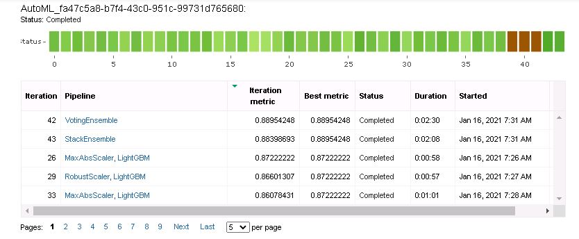
 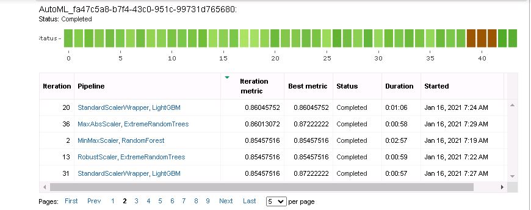
 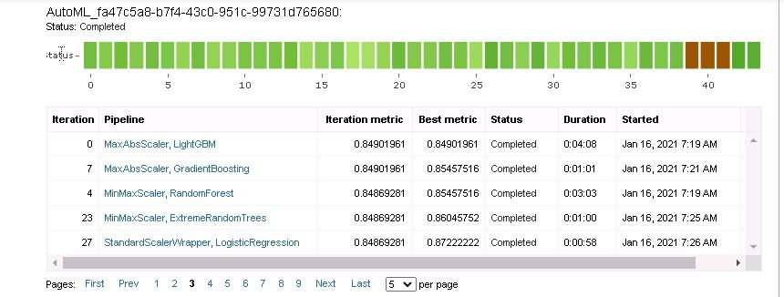
 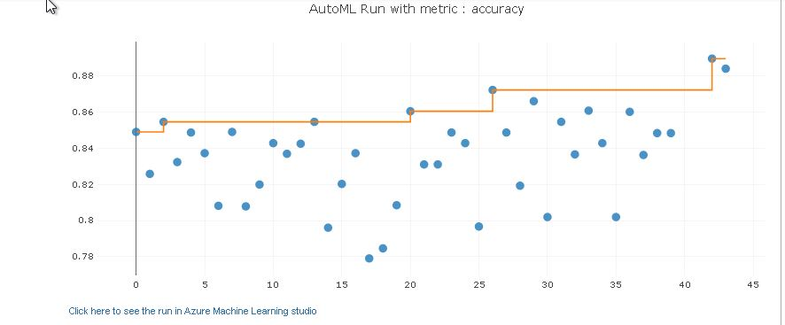

The RunDetail Widgets in the Jupyter Notebook show us the progress of all the training runs with their status and accuracy value.

**Best Model**

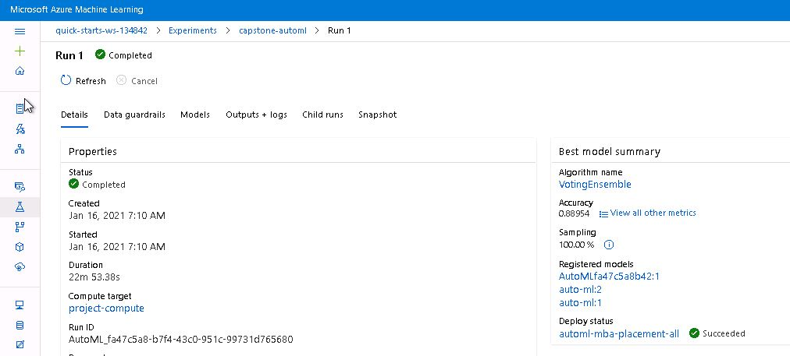

In this screenshot we can see the best model, it's run id, accuracy, algorithm name and registered model name.

## Hyperparameter Tuning
In this experiment RandomForest Classifier is used which is a supervised learning algorithm. The reason for this choice is that Random Forest is considered highly accurate and robust because of the number of decision trees participating in this process. It also does not suffer from overfitting as it takes average of all predictions and this cancels out biases.
The hyper parameters tuned in the experiment were n_estimators with a choice of 10,100 & 1000 and min_samples_split with a choice of 2, 4 & 6.
1. n_estimators - This parameter tells us the number of trees in the forest. High value gives better performance till a certain value and then the performance stagnates. Hence we need to choose an optimum value as too high a value will result in no gain at high cost.
2. min_samples_split - is the minimum number of samples required to split an internal node. By increasing the value we can reduce the number of splits that happen in the decision tree and hence prevent overfitting. 
The parameter sampling method chosen was RandomParameterSampling as it supports both discrete and continuous hyperparameters and supports early termination of low performing runs. The early termination policy chosen was Bandit Policy. Bandit Policy is based on slack factor with respect to best performing training run and since our goal is to maximize primary metric accuracy this policy is most suitable.
I have used a cutom environment saved as file rf_env.yml.

### Results
**Result** -The best performing model has n_estimators value 10 and min_samples_split value 4 and the accuracy of the model is 0.8837209302325582
We have used the RandomForest algorithm. 
**Improvement Suggestion**-The model can be improved by experimenting with other classification models like Logistic Regression, Ridge Classifier and SVM. We can also experiment with continuous hyperparameters instead of discrete values.

**RunDetails for Hyperdrive Model**

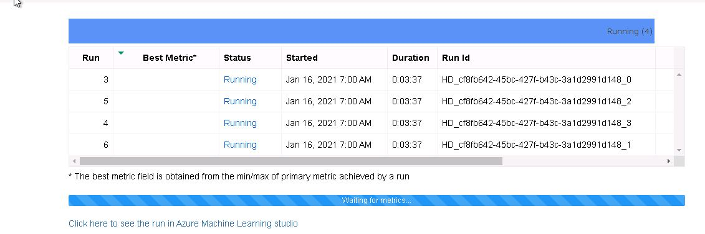
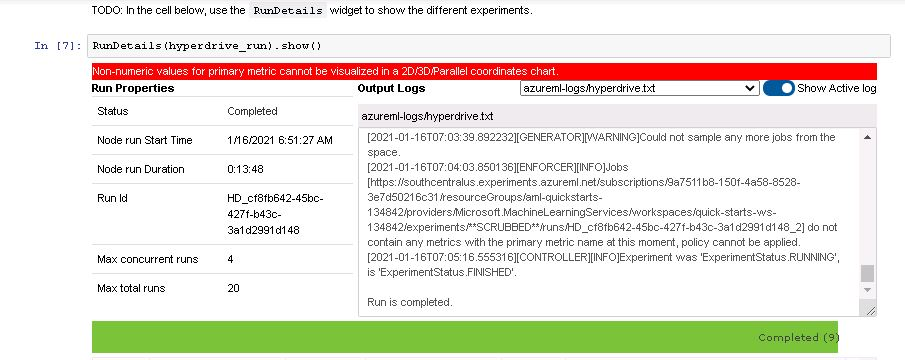
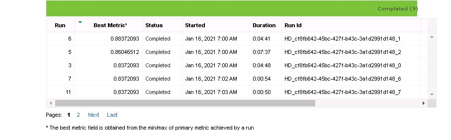
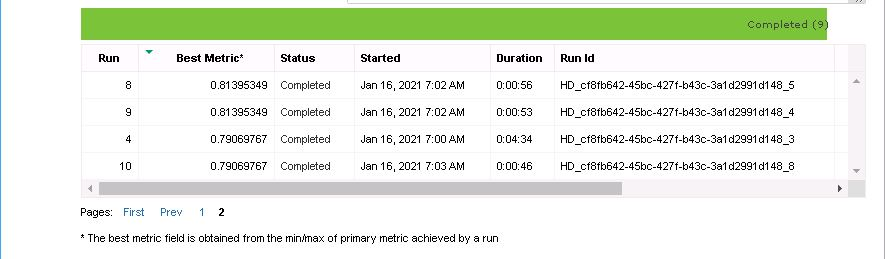
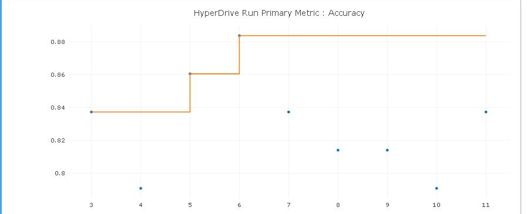
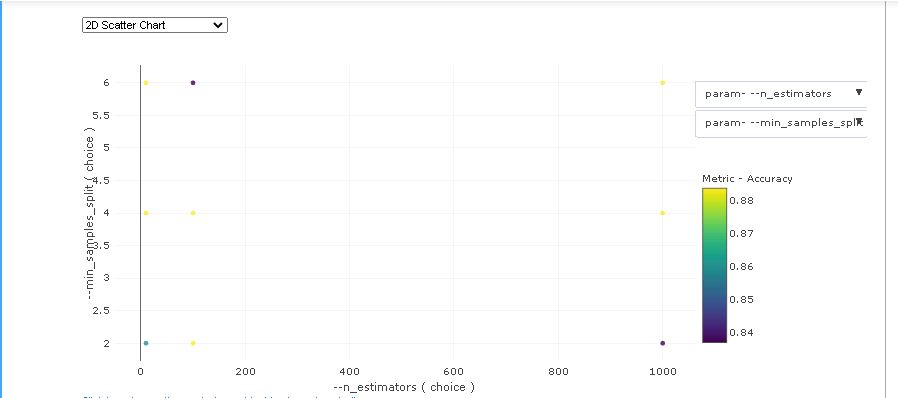

The RunDetails Widget in the jupyter notebook shows us the progress of the training runs, a graph of the change in the accuracy metric with each run and a 2D Scatter Chart.

**Best Model-Hyperdrive**

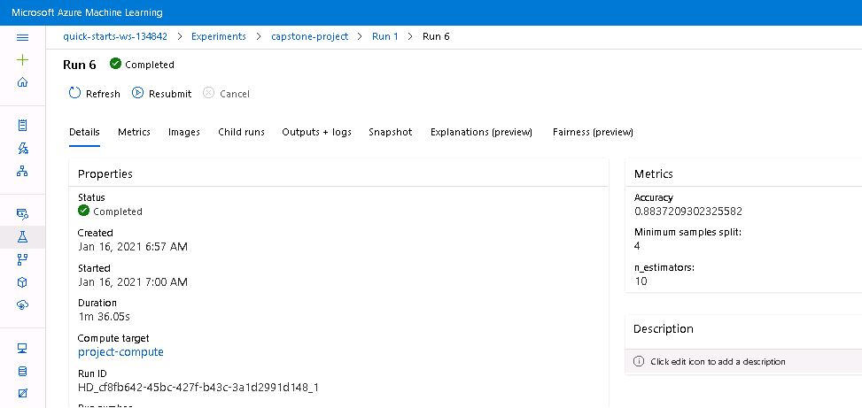

In this screenshot we can see the best model, it's run id, accuracy and hyperparameters.

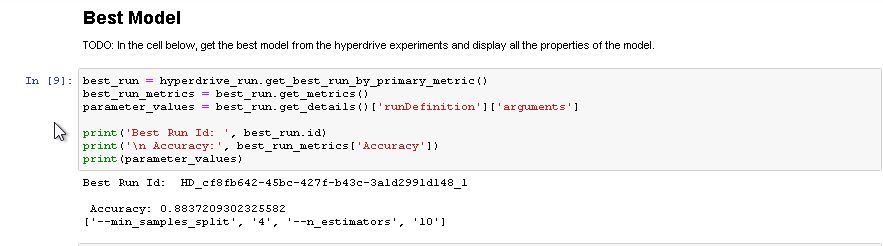

This shows the Best Model in Jupyter Notebook using Python SDK.

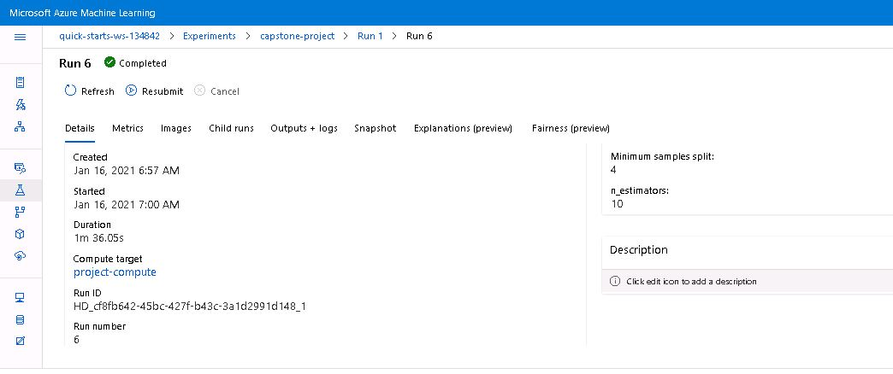
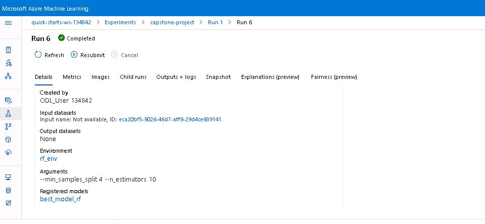

In these screenshots we can see the best model, accuracy, run id, compute target, hyperparameters value , custom environment and registered model name.

## Model Deployment
Since the AutoML Model performs better than the Hyperdrive Model with an accuracy of 0.88954 we have deployed the AutoML Model.
The deployed model has the algorithm Voting Ensemble. The automl model has been registered by the model name AutoMLfa47c5a8b42 and we have enabled the authentication keys. The application insights have also been enabled. The deployed model name is automl-mba-placement-all.

**Successfully Deployed Model**

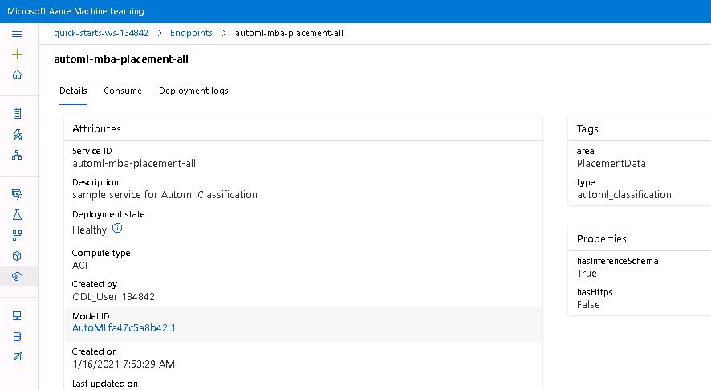

In this screenshot we can see that the deployment state of deployed model is healthy.

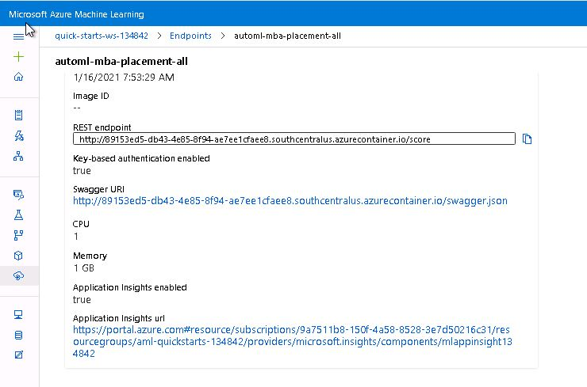

Here we can see that Application Insights is enabled which is an additional feature of the model.

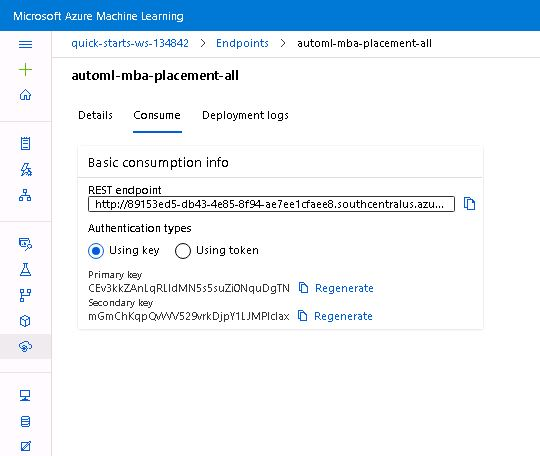

In this image we can see the REST endpoint and authentication keys needed to consume the model.

Instructions to query the endpoint:
1. Define an entry script specific to the model. It loads the model using a function called init() and runs the model on input data using a function called run(). Every time the model receives a scoring request the run function is executed.
2. When sending a request to a service that is secured with a key or token, use the Authorization header to pass the key or token.
3. When we deploy the model as a web service it creates a REST API Endpoint which expects the body of the request to be a JSON document.
4. Using Python SDK we will enter data in the format:
data = {
    "data":
        [
            model-specific-data-structure
        ]
}   
and then convert it into JSON string by using json.dumps(data).
5. Next we set the content type and after enabling the authentication keys and using the scoring_uri we send a request to the endpoint and then display the response using print statement.

**Demo of Sample Request Send to Endpoint**

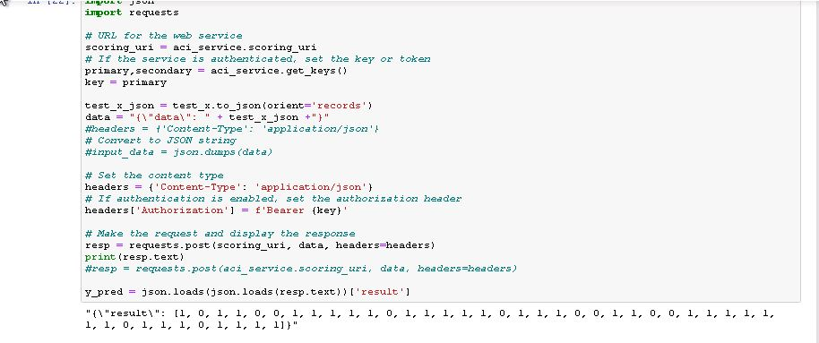

Here we can see the prediction result for the test data send as sample request.

## Screen Recording
[Screencast Link for Capstone Project](https://youtu.be/Ckqxar3BVCw "Screencast for Project3-Capstone Project")

## Acknowledgement
I would like to thank Udacity for the course work and Microsoft for providing this opportunity.
I have used dataset from Kaggle and would like to thank them for providing it. 
Resources used to complete the project are Kaggle, Udacity course work, scikit learn documentation and microsoft azure documentation.